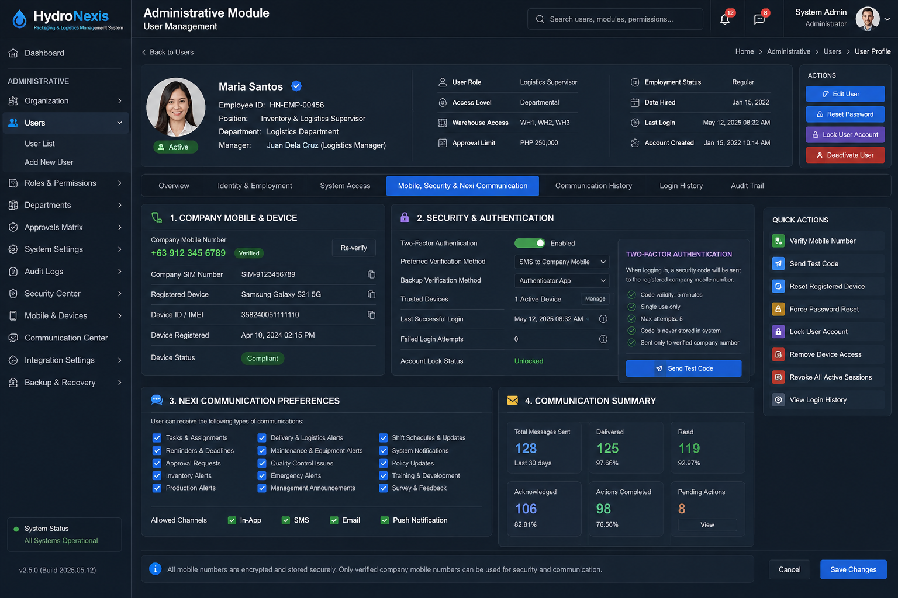

# HydroNexis-AI — Integrated Productivity, Inventory, Apps, and Secure Communication Upgrade

Status: Proposed implementation addendum to the Packaging & Logistics developer specification
Primary goal: Convert all inactive or isolated tabs into one operational management system in which Nexi can read, analyze, assign, communicate, verify, and report across HydroNexis, SOS Inventory, GOS apps, employees, vehicles, warehouses, packaging, logistics, accounting, and management.

────────

## 1. Required Operating Model

HydroNexis must become the intelligent operational control layer. SOS Inventory and the GOS applications remain connected systems of record where appropriate, but users should not need to manually copy the same information between systems.

Every important transaction should follow one shared lifecycle:

1. A demand, order, request, task, issue, or alert is created.
2. Nexi identifies the responsible department, employee, deadline, required inventory, and approvals.
3. The transaction is synchronized with SOS Inventory and/or the relevant GOS app.
4. Nexi sends a secure in-app or company-mobile notification.
5. The employee acknowledges, performs, and reports the work.
6. Evidence is attached: quantity, status, photo, QR/NFC scan, GPS location, signature, or document.
7. Nexi validates the result against policy and expected data.
8. Inventory, production, packaging, logistics, accounting, and management reports update automatically.
9. Exceptions are escalated until resolved.

No operational tab should exist only as a visual page. Each tab must have defined inputs, actions, outputs, ownership, permissions, notifications, and audit history.

────────

## 2. Unified Integration Architecture

### 2.1 Core integration services

Create a central HNX Integration Hub with the following services:

- Canonical Data Layer: One internal identifier for every employee, customer, supplier, SKU, material, crate, warehouse, greenhouse, vehicle, driver, order, delivery, task, issue, and document.
- Connector Layer: SOS Inventory connector, GOS application connectors, QuickBooks connector where already supported, SMS/mobile messaging provider, email, GPS/telematics, QR/NFC, and cloud file storage.
- Event Bus: Publishes operational events such as order.created, stock.reserved, pick.completed, delivery.departed, task.overdue, and employee.acknowledged.
- Workflow Engine: Executes approvals, assignments, reminders, escalation rules, and automatic follow-up.
- Nexi Intelligence Layer: Reads normalized data, explains performance, recommends actions, creates approved tasks, and communicates with users.
- Audit and Security Layer: Records every read, write, approval, message, API synchronization, and failed access attempt.

### 2.2 Source-of-truth policy

| Data type | Primary source of truth | HydroNexis responsibility |
|---|---|---|
| Item/SKU master | SOS Inventory | Mirror and enrich with operational fields |
| Inventory quantity and valuation | SOS Inventory | Show live stock, reserve, request movement, reconcile |
| Operational task status | HydroNexis | Assign, monitor, verify, escalate |
| Employee identity and role | HydroNexis HR master | Synchronize permitted details to connected apps |
| Accounting entries | QuickBooks/SOS according to current setup | Display status and reconciliation, never duplicate ledgers |
| Production and greenhouse records | HydroNexis | Create material demand and finished-goods events |
| Packaging sessions and crate records | HydroNexis | Send material consumption and finished goods to SOS |
| Vehicle GPS and trip evidence | GPS/telematics system | Match evidence to deliveries and reports |
| Customer orders and shipment plan | SOS/GOS according to order origin | Normalize into one HydroNexis order and fulfillment view |
| Communication history | HydroNexis Communication Center | Store delivery, acknowledgment, and action audit trail |

────────

## 3. Connect Every Tab and Box

Create a View Capability Registry for every module tab and dashboard box.

Each entry must define:

```js
{
  viewId,
  module,
  title,
  status: 'live' | 'partial' | 'stub' | 'disabled',
  dataSources: [],
  actions: [],
  permissions: [],
  ownerRole,
  kpis: [],
  notifications: [],
  nexCommands: [],
  auditEvents: []
}
```

### 3.1 Treatment of inactive tabs

For each inactive tab, choose one of only three outcomes:

1. Activate: Connect it to live data and workflows.
2. Merge: Redirect it into a stronger existing screen while preserving the navigation label if needed.
3. Remove: Hide the tab when it has no operational purpose.

A stub screen must never remain visible to normal users.

### 3.2 Immediate Packaging and Logistics corrections

- Link logistics delivery jobs, crate delivery cycles, and GPS trip evidence through one fulfillmentId.
- Add warehouseId, salesOrderId, shipmentId, crateDeliveryId, and gpsTripId to the canonical fulfillment record.
- Replace free-text delivery items with structured lines containing SKU, quantity, UOM, lot/batch, crate IDs, and warehouse.
- Connect packaging materials to SOS item IDs rather than maintaining an unrelated stock balance.
- Add cold-storage, crate availability, pending returns, and stock exceptions to the Packaging Dashboard.
- Convert the Logistics Command Center from demo values to live operational metrics.
- Register wash-and-trim sessions, packaging materials, crates, fuel, and deliveries as direct Nexi data collections.
- Replace pack_operations with a live Packaging Operations Board or remove it.

────────

## 4. SOS Inventory Integration

### 4.1 Required data synchronization

HydroNexis should read or synchronize:

- Items, SKUs, descriptions, categories, UOMs, barcodes, preferred suppliers, standard costs, and reorder levels.
- Warehouses and locations.
- Available, committed, on-order, and incoming quantities.
- Purchase orders, receipts, vendor returns, transfer orders, sales orders, shipments, and customer returns.
- Lot/batch and expiry information where applicable.
- Assembly/build transactions for packaged finished goods.
- COGS and inventory movement references needed for management reporting.

### 4.2 Operational workflows

Item request and warehouse release

1. User creates an Item Request in HydroNexis.
2. Nexi checks current SOS stock, reservations, incoming POs, and alternative warehouses.
3. Required approval is routed according to value, item category, and department.
4. Warehouse receives a pick task with QR/barcode confirmation.
5. Release creates or updates the correct SOS transaction.
6. Requester receives confirmation and the department cost center is recorded.
7. Nexi reports shortages, substitutions, excess usage, and late fulfillment.

Packaging material consumption

1. Wash-and-trim or packaging session opens a material reservation.
2. Expected consumption is calculated from planned output.
3. Actual consumption is scanned or entered.
4. Variance is calculated.
5. Approved actual consumption posts to SOS.
6. Abnormal variance becomes a Nexi issue or supervisor approval.

Finished-goods completion

1. Packaging output is recorded by SKU, lot, weight, and expiry.
2. QC release is required before available stock increases.
3. An SOS build/receipt transaction is created.
4. Finished stock is assigned to cold-storage location.
5. Customer shipment consumes the correct lot and quantity.

### 4.3 Synchronization controls

Every external transaction must store:

- externalSystem
- externalId
- syncStatus
- lastSyncAt
- syncVersion
- lastError
- retryCount
- createdBy
- approvedBy

Use idempotency keys to prevent duplicate releases, receipts, shipments, or accounting movements.

────────

## 5. GOS Applications Integration

Because different GOS apps may own different functions, build a connector contract rather than hard-coding each screen.

Each GOS connector must declare:

- Objects it can read and write.
- Fields and validation rules.
- Authentication method.
- Real-time webhook support or polling frequency.
- Conflict-resolution policy.
- Source-of-truth ownership.
- Error and retry behavior.
- Permitted employee roles.

The HydroNexis dashboard should show connector health:

- Connected/disconnected.
- Last successful synchronization.
- Pending records.
- Failed records.
- Conflicts requiring review.
- API or authentication expiry warnings.

Nexi may explain or recommend corrections, but high-impact writes must follow approval policy.

────────

## 6. Employee Company-Mobile Directory

Add a controlled Employee Communication Profile to the employee master.

### 6.1 Recommended fields

```js
{
  employeeId,
  fullName,
  department,
  position,
  managerId,
  companyPhoneE164,
  companySimNumber,
  deviceId,
  devicePlatform,
  communicationChannels: {
    inApp: true,
    sms: false,
    whatsappBusiness: false,
    push: true,
    email: true,
    radio: false
  },
  preferredLanguage,
  workScheduleId,
  emergencyContactAllowed: false,
  deviceComplianceStatus,
  lastDeviceCheckAt,
  active,
  consentAndPolicyAcceptedAt
}
```

Store phone numbers in international E.164 format, for example +63.... Separate company phone numbers from personal numbers. Personal numbers should not be required for normal operational messaging.

### 6.2 Communication hierarchy

Use the following priority:

1. Secure HydroNexis mobile-app push and in-app inbox.
2. Approved company messaging channel, such as managed WhatsApp Business or another enterprise provider.
3. SMS for urgent fallback or acknowledgement failure.
4. Email for formal documents and non-urgent summaries.
5. Radio/voice dispatch for immediate field coordination, with task details still recorded in HydroNexis.

Do not send confidential operational data in ordinary SMS. SMS should contain only a minimal alert and a secure deep link requiring authentication.

### 6.3 Placement: Administrative Module → User Management

The company-mobile directory, communication permissions, and login-security settings live in the **Administrative Module → User Management** screen. The canonical navigation is:

**Administrative Module → Users → Select Employee → Mobile, Security & Nexi Communication**

This ensures the phone number is not only a contact detail — it becomes part of the employee's identity, security, communication, task management, and audit system.

Each user profile must include:

- Employee name and ID
- Department and position
- User role and access level
- Company mobile number
- Company SIM number
- Registered device
- Preferred language
- Immediate manager
- Active/inactive employment status
- Allowed Nexi communication channels
- Mobile verification status
- Last successful login
- Device security status

#### 6.3.1 User screen sections

**Identity and Employment** — basic employee information, department, position, manager, and employment status.

**System Access** — role, module permissions, approval limits, warehouse permissions, report access, and administrative rights.

**Company Mobile and Device** — phone number, SIM, device model, device ID, registration date, and whether the device is compliant.

**Security** — two-factor authentication enabled, preferred verification method, password reset controls, trusted devices, last login, failed attempts, and account lock status.

**Nexi Communication** — types of messages the user may receive: tasks, reminders, approvals, emergency alerts, production issues, inventory alerts, maintenance notices, and management announcements.

**Communication History** — messages sent, delivery status, read status, acknowledgement, response, and action completed.

#### 6.3.2 Manager actions

A manager must be able to perform, from the user screen:

- Verify mobile number
- Send test code
- Reset registered device
- Force password reset
- Lock user account
- Remove device access
- Revoke all active sessions
- View login history

#### 6.3.3 Two-factor authentication flow

Nexi login security supports two-factor authentication:

1. The user enters their username and password.
2. Nexi sends a temporary security code to the registered company mobile number.
3. The user enters the code.
4. Nexi verifies the code, device, user role, and access permissions.
5. The login is recorded in the audit trail.

The code must:

- Expire after approximately 3–5 minutes.
- Work only once.
- Have a limited number of attempts.
- Trigger an alert after repeated failed attempts.
- Never be visible to administrators after it is generated.
- Be sent only to the verified company number.

#### 6.3.4 Reference UI design

Approved mockup: `docs/assets/user-management-mockup.png` (HydroNexis dark theme).



Layout to implement:

- **Profile header** — photo with verified badge, name, employee ID (`HN-EMP-…`), position, department, manager, Active/Inactive chip; second column: user role, access level, **warehouse access (WH1, WH2, WH3…)**, approval limit (₱); third column: employment status, date hired, last login, account created. Right rail **ACTIONS**: Edit User, Reset Password, Lock User Account, Deactivate User.
- **Tab strip** — Overview · Identity & Employment · System Access · **Mobile, Security & Nexi Communication** (this design) · Communication History · Login History · Audit Trail — matching the six sections in 6.3.1.
- **Panel 1 — Company Mobile & Device**: mobile number in E.164 (+63…) with Verified chip and Re-verify button; SIM number, registered device model, device ID/IMEI (copy buttons), registration date, device status chip (Compliant / Non-compliant).
- **Panel 2 — Security & Authentication**: 2FA toggle, preferred verification method (SMS to company mobile), backup method (authenticator app), trusted devices count + Manage, last successful login, failed login attempts, account lock status. Side card restates the OTP rules as checklist: 5-minute validity, single use, max 5 attempts, never stored in system, sent only to verified company number; **Send Test Code** button.
- **Panel 3 — Nexi Communication Preferences**: checkbox grid of receivable message types (tasks & assignments, reminders & deadlines, approvals, inventory alerts, production alerts, delivery & logistics, maintenance & equipment, QC issues, emergency, management announcements, shift schedules, system notifications, policy updates, training, surveys) + allowed channels row (In-App / SMS / Email / Push).
- **Panel 4 — Communication Summary**: stat tiles Total Sent (30d), Delivered %, Read %, Acknowledged %, Actions Completed %, Pending Actions with drill-down View.
- **Quick Actions rail** — the eight manager actions from 6.3.2 as one-click buttons.
- **Footer note** — "All mobile numbers are encrypted and stored securely. Only verified company mobile numbers can be used for security and communication." + Cancel / Save Changes.

Implementation note: OTP generation, verification, session/device registry, and the audit trail are server-side responsibilities (Track B — see section 11's storage requirement). The User Management screen in the Administrative Module is the client surface; codes, password hashes, and session tokens must never be stored or verifiable in browser localStorage.

────────

## 7. Nexi Interactive Communication

Create a Nexi Communication Center with individual, team, department, and role-based messaging.

### 7.1 Message types

- New task assignment.
- Reminder before deadline.
- Overdue escalation.
- Approval request.
- Stock shortage or expected delivery.
- Equipment or maintenance alert.
- Delivery dispatch, route change, or customer exception.
- Quality-control failure.
- Policy acknowledgement.
- Daily shift briefing.
- End-of-shift unresolved work summary.
- Emergency operational notice.

### 7.2 Required interaction buttons

Each actionable message should support secure buttons such as:

- Acknowledge.
- Accept task.
- Start.
- Complete.
- Cannot complete.
- Need assistance.
- Approve.
- Reject with reason.
- Upload photo.
- Scan QR/NFC.
- Call supervisor.
- Open related record.

Every response must update the originating task or transaction, not merely create a chat reply.

### 7.3 Intelligent routing

Nexi determines recipients using:

- Department and position.
- Shift and attendance.
- Assigned greenhouse, warehouse, route, machine, or customer.
- Current workload.
- Required skill or certification.
- Availability and leave status.
- Escalation chain.

Nexi should not contact every employee for every issue. It should first assign the correct owner, then escalate only when necessary.

────────

## 8. Intelligent Management Layer

### 8.1 Management command center

Create one executive view with drill-down access to:

- Sales orders due today and this week.
- Production readiness versus demand.
- Raw-material and packaging-material shortages.
- Inventory availability and committed stock.
- QC holds and rejected batches.
- Packing completion and shipment readiness.
- Deliveries dispatched, late, failed, and awaiting proof.
- Customer crate balances and overdue returns.
- Open issues, calls, and overdue tasks.
- Employee workload, acknowledgement, and completion rates.
- Vehicle availability, fuel efficiency, service due, and GPS exceptions.
- Purchasing requirements and incoming PO risk.
- Inventory value, consumption variance, and COGS indicators.
- Connector health for SOS, GOS, QuickBooks, GPS, and messaging.

### 8.2 Nexi management functions

Nexi should be able to answer questions such as:

- What customer orders are at risk today and why?
- Which items will run out before the next purchase order arrives?
- What was expected versus actual packaging-material consumption?
- Which deliveries are ready but not dispatched?
- Which employee has not acknowledged an urgent task?
- Which crate balances are overdue by customer?
- What caused today's production or logistics delay?
- What corrective actions need approval?
- What changed since yesterday?

Nexi should also produce a prioritized action list with owner, deadline, business impact, and recommended action.

### 8.3 Approval boundaries

Nexi may automatically:

- Send reminders.
- Create low-risk tasks.
- Recommend reassignments.
- Prepare reports.
- Draft requests and messages.
- Flag exceptions.

Nexi must require human approval for:

- Inventory adjustments above tolerance.
- Purchase commitments.
- Customer order cancellation or price change.
- Payroll or disciplinary action.
- Accounting postings outside approved automatic workflows.
- Disclosure of confidential information.
- Changing employee permissions.

────────

## 9. Security and Data Protection

### 9.1 Identity and access

- Single sign-on with multi-factor authentication for management and sensitive roles.
- Role-based access plus record-level restrictions.
- Device registration for company phones.
- Remote session revocation and remote wipe through mobile-device management where available.
- Short-lived access tokens; no passwords stored in localStorage.
- Separate service accounts for SOS, GOS, messaging, GPS, and accounting connectors.

### 9.2 Mobile security

- Company phones enrolled in mobile-device management.
- Screen lock, encryption, and minimum OS requirements enforced.
- Copy/paste, downloads, screenshots, camera use, and file sharing restricted according to role.
- Operational photos uploaded directly to secure storage and removed from the local gallery when policy permits.
- No confidential content in lock-screen notification previews.
- Lost or non-compliant devices automatically lose access.

### 9.3 Communication security

- Message payloads encrypted in transit and at rest.
- Sensitive information displayed only after login.
- Signed deep links with short expiration.
- Recipient verification before sending.
- Full audit trail: sender, automated rule, recipient, delivery, read, acknowledgement, action, and escalation.
- Retention rules by message type.

### 9.4 Data minimization

Nexi sends only the information needed for the employee's task. A driver does not need inventory valuation, and a warehouse picker does not need customer financial information.

────────

## 10. Reporting and Productivity Analytics

### 10.1 Employee productivity

Measure work, not merely app activity:

- Tasks assigned, accepted, completed, overdue, reopened.
- Response and acknowledgement time.
- First-time completion rate.
- Quantity processed.
- Quality/error rate.
- Variance from expected time or material use.
- Escalations required.
- Supervisor verification.

Metrics must be adjusted by task type, complexity, shift, and available resources to avoid unfair comparisons.

### 10.2 Operational reports

- Order-to-delivery cycle time.
- Inventory request-to-release time.
- Purchase order lead time and supplier reliability.
- Production plan versus actual.
- Packaging yield and material variance.
- QC pass rate and recurring causes.
- Warehouse accuracy and stock reconciliation.
- Delivery on-time performance and proof completion.
- Crate utilization, loss, damage, and customer aging.
- Vehicle utilization, fuel, service, and route performance.
- Department task completion and issue closure.

Every KPI should drill down to the supporting records.

────────

## 11. Recommended Data Objects

Create or normalize these objects:

- hnx_employee_profiles
- hnx_employee_devices
- hnx_communication_preferences
- hnx_messages
- hnx_message_deliveries
- hnx_acknowledgements
- hnx_tasks
- hnx_task_events
- hnx_approvals
- hnx_fulfillments
- hnx_fulfillment_lines
- hnx_inventory_requests
- hnx_inventory_movements
- hnx_external_links
- hnx_sync_jobs
- hnx_sync_errors
- hnx_connector_health
- hnx_audit_events

Do not place this new data only in browser localStorage. Operational records, communications, permissions, and audit events require a secured server database with offline caching only where necessary.

────────

## 12. Implementation Phases

Phase 1 — Foundation and audit

- Inventory every tab, box, renderer, data key, permission, and stub.
- Build the View Capability Registry.
- Define canonical IDs and source-of-truth ownership.
- Create employee company-phone directory fields.
- Establish server-side identity, permissions, audit, and connector framework.

Phase 2 — SOS Inventory and Warehouse

- Connect item master, warehouses, stock, POs, sales orders, shipments, and transfers.
- Build Item Request → approval → pick → release workflow.
- Link packaging materials and consumption to SOS SKUs.
- Build reconciliation and synchronization-error screens.

Phase 3 — Fulfillment and Logistics unification

- Create canonical fulfillment and structured delivery lines.
- Link customer delivery, crates, warehouse release, GPS trip, proof, and return cycle.
- Activate Logistics Command Center with live data.
- Add proof-of-delivery and exception workflows.

Phase 4 — Secure employee communication

- Build Administrative Module → User Management: per-employee Mobile, Security & Nexi Communication sections with manager actions (section 6.3).
- Implement two-factor authentication with mobile OTP (section 6.3.3).
- Enroll company phones.
- Implement secure app notifications and inbox.
- Add acknowledgements and action buttons.
- Add SMS or approved enterprise messaging fallback.
- Implement escalation and communication audit.

Phase 5 — GOS app connectors

- Map each GOS application.
- Implement read/write contracts and conflict handling.
- Add connector-health dashboard.
- Remove remaining duplicate manual entry.

Phase 6 — Nexi intelligent management

- Add direct collections for packaging, fuel, inventory, fulfillment, tasks, communications, and employees.
- Build management questions, exception detection, recommendations, and daily briefings.
- Add controlled automatic task creation and approval routing.

Phase 7 — Optimization

- Predict demand and shortages.
- Optimize production, packaging, labor, delivery routes, and purchasing.
- Introduce anomaly detection and root-cause summaries.
- Add role-specific productivity coaching and continuous-improvement reports.

────────

## 13. Immediate Developer Backlog

Critical

1. Replace visible stub tabs with live, merged, or hidden states.
2. Create canonical fulfillmentId linking logistics deliveries, crates, warehouse, and GPS.
3. Replace delivery free text with structured SKU lines.
4. Build SOS item and inventory connector with idempotent write protection.
5. Move operational data, permissions, messages, and audits to server storage.
6. Add employee company-phone and managed-device profiles in Administrative Module → User Management (section 6.3), including the 2FA login flow.
7. Build secure Nexi inbox, acknowledgement, and escalation workflow.

High

8. Connect packaging materials to SOS SKUs and post actual consumption.
9. Add cold-storage and crate KPIs to Packaging Dashboard.
10. Make Logistics Command Center live.
11. Register W&T, materials, fuel, fulfillment, and task collections in Nexi.
12. Add connector-health and synchronization-error dashboards.
13. Create executive exception and action dashboard.

Medium

14. Add WhatsApp Business or comparable approved enterprise messaging after security review.
15. Add QR/NFC confirmation for warehouse, packaging, assets, and delivery.
16. Add device compliance and remote access revocation.
17. Add predictive shortage, late-order, and recurring-failure models.

────────

## 14. Acceptance Criteria

The upgrade is complete only when:

- Every visible tab has a real business function and live data.
- A transaction can be followed from demand through inventory, production, packaging, dispatch, delivery, return, and accounting reference.
- SOS and GOS synchronization errors are visible and recoverable.
- Nexi can identify the responsible user and communicate securely.
- Employee acknowledgements and actions update the originating record.
- Management can see real-time exceptions and drill down to evidence.
- No confidential operational data is exposed through unsecured SMS or unmanaged personal devices.
- Every critical action has permission checks, approval rules, and an audit trail.
- Duplicate entries across HydroNexis, SOS, GOS, and QuickBooks are materially eliminated.
