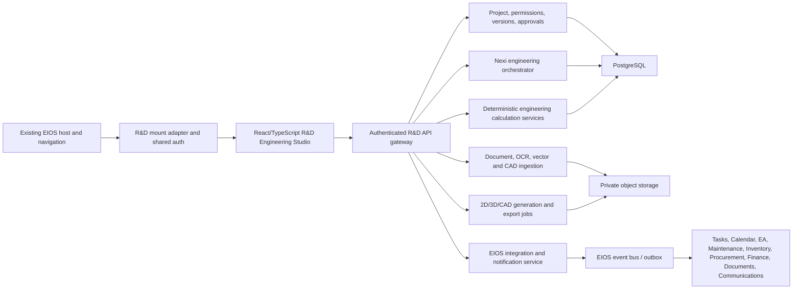

# HydroNexis-AI R&D & Planning — Nexi Engineering Master Developer Specification

**Company:** ABA PARDES Agritech Corp.  
**System:** HydroNexis-AI EIOS  
**Module:** R&D & Planning / Nexi Engineering Studio  
**Document version:** 1.0  
**Date:** 2026-08-09  
**Product owner and current final authority:** President / CEO  
**Status:** Approved product direction; implementation specification  
**Classification:** Confidential company asset — internal and authorized project use only  

---

## 1. Executive mandate

Build R&D & Planning as HydroNexis-AI's professional AI engineering operating system, not as a basic drawing page.

The module must let an authorized user upload or describe a plan and collaborate with Nexi to produce, review, revise, approve, schedule, cost, procure, export, and maintain a complete engineering project. Nexi must combine professional 2D CAD, editable 3D/BIM-style models, engineering calculations, standards, project controls, EIOS data, and transparent AI reasoning.

The long-term objective is to automate routine engineering and management work so human roles increasingly focus on strategy, exceptions, professional certification, and governance. Nexi must never claim a professional license, certify work, or bypass legally required qualified-human approval.

### 1.1 Primary outcome

For every authorized project, the module shall be capable of producing a traceable package containing any selected combination of:

- Source files and benchmark/reference plans.
- Editable 2D drawings and schematics.
- Editable 3D, parametric, BIM-style, or live digital-twin views.
- Design alternatives and comparison against Nexi's recommended option.
- Calculations, assumptions, source citations, confidence, and unresolved risks.
- Bill of Materials (BOM), specifications, quantities, availability, estimated cost, and lead times.
- Constructability, maintainability, clash, clearance, safety, and compliance reviews.
- AI-generated work method, tasks, dependencies, resources, milestones, and Gantt schedule.
- Approval, electronic signature, revision, audit, and issue records.
- Branded PDF, SVG, Excel/CSV, DXF, print, image, and 3D export packages.
- Project-linked inventory reservations, procurement requests, financial approvals, delivery tracking, and maintenance handoff.

### 1.2 Definition of “professional”

Professional means:

1. Geometry is editable, measurable, scaled, versioned, and exportable—not a flattened AI image.
2. Calculations use deterministic, testable engineering functions and versioned rules.
3. Nexi distinguishes known values, extracted values, user inputs, assumptions, calculations, recommendations, and unresolved items.
4. Every consequential output is traceable to its source, author/agent, time, version, and approval state.
5. Safety/legal/financial gates cannot be silently bypassed.
6. A qualified person can inspect and independently verify the complete engineering basis.

---

## 2. Binding product decisions

These decisions combine the President / CEO's completed Round 1 and Round 2 questionnaires. Developers must treat them as requirements.

| Area | Binding decision |
|---|---|
| Users | President/CEO, R&D engineers, planners, maintenance, IT managers, supervisors, and permission-limited external engineers/contractors. |
| Authority | President/CEO currently has full access and final internal authority. Admin can later configure delegated roles, planning rights, approval stages, and limits. |
| Default autonomy | Supervised mode. Each project can be placed in Copilot, Supervised, or Maximum Autonomy mode. |
| Human gates | Safety, legal, financial commitments, and issued drawings always require an authorized human. Required professional approval cannot be skipped. |
| Intake | Read uploaded files, classify them, extract content/geometry, detect gaps/risks, ask focused questions, and allow “skip this” or “skip all and use Nexi assumptions.” |
| Engineering scope | Greenhouse/agricultural, civil, structural, mechanical, HVAC, plumbing, irrigation, drainage, fertigation, electrical, controls, sensors, automation, IT engineering, industrial engineering, packaging machines, plus admin-defined disciplines. |
| Workspace | Executive Cockpit, Simple Planning, and Professional Engineering Studio modes; conversation/voice and direct CAD editing work together. |
| 2D | AutoCAD-level professional canvas with full object, image, measurement, layer, block, symbol, annotation, and history controls. |
| Collaboration | Real-time co-editing for authorized users, branches/duplicates for users without original-edit rights, merge/compare, attribution, immutable old versions, and file check-in/out where needed. |
| 3D | Selectable levels: preview, accurate parametric 3D, BIM-style model, or live digital twin, depending on available data and project needs. |
| Intelligence | Nexi produces alternatives on request, always compares them with a recommended best option, and shows evidence, assumptions, calculations, confidence, and risks. |
| Learning | Learn from approved EIOS data, drawings, results, costs, problems, standards, and verified professional web sources under governance and audit. |
| Outputs | User-selectable export dropdown; branded PDF/SVG/Excel/DXF/print and appropriate CAD/3D formats; native DWG after licensing. |
| Project controls | AI Gantt, tasks, dependencies, resources, approvals, notifications, and EIOS module handoffs. |
| Procurement | Check selected warehouse, reserve stock, create project-coded shortage requests, route procurement/finance approvals, and require CEO approval above configured thresholds or for exceptions. |
| Hosting | Private company cloud, encrypted storage/backups, MFA, least privilege, retention, and disaster recovery. |
| Company assets | Every project document is a confidential company asset. External access is project-only and time-limited; every access/share/export is audited. |
| First usable release | Must include the professional 2D engine, plan analysis, Nexi questions/recommendations, calculations/BOM/cost/risk/Gantt, branded exports, basic synchronized 3D, permissions, versions, approvals, audit, tasks, and notifications. |

---

## 3. Architecture decision and reconciliation

### 3.1 Required hybrid migration

The existing large EIOS HTML file remains the visible host during migration, so users continue entering R&D & Planning from the current EIOS shell. However, developers must not continue adding the R&D engine as new injection layers inside that file.

The current audit documents approximately 77 competing injection layers and a 17 MB host. Browser-only code also cannot safely provide production PDF/OCR parsing, collaborative transactions, DWG conversion, secure AI secrets, durable jobs, or governed autonomous actions.

Therefore:

- Keep the existing single HTML as the temporary EIOS shell and navigation host.
- Add only a thin, stable mount adapter: `#hnx-rnd-root` plus the compiled R&D bundle loader.
- Implement new R&D UI and domain logic as modular TypeScript/React packages.
- Implement AI, document parsing, engineering computation, exports, collaboration, integrations, and jobs in authenticated backend services.
- Store structured records in PostgreSQL and files/models in private object storage.
- Migrate data in phases, validate it, then retire the legacy R&D implementation.
- Preserve a read-only legacy view until migration is reconciled and signed off.

This satisfies the requirement to keep development accessible inside the existing EIOS page while making the engineering system reliable and maintainable.

### 3.2 Target architecture



### 3.3 Recommended implementation stack

- Frontend: TypeScript, React, Vite, a tested scene engine, WebGL/Three.js for 3D.
- Backend: Python FastAPI for AI, parsing, engineering, CAD/export, and integration endpoints.
- Database: PostgreSQL 14+ with tenant and project scoping.
- Object storage: private S3-compatible storage/Cloudflare R2 with short-lived signed URLs.
- Realtime: authenticated WebSocket service or equivalent for presence, co-editing, locks, and notifications.
- Async jobs: durable queue plus worker processes; do not use in-memory job dictionaries in production.
- Cache/locks: Redis or managed equivalent where required.
- Deployment: separate development, test, staging, and production environments in the private company cloud.
- Observability: structured logs, traces, metrics, audit events, model/tool telemetry, and alerting with sensitive-data redaction.

---

## 4. Users, roles, and permissions

### 4.1 Default role matrix

| Role | Default rights |
|---|---|
| President / CEO | Full tenant access; final internal approval; policy, autonomy, financial threshold, emergency override, and Nexi-governance control. |
| EIOS Admin | Configure tenants, roles, permissions, project templates, disciplines, workflows, standards, retention, integrations, and Nexi policies; no automatic right to professionally certify drawings. |
| R&D Engineer | Create/edit assigned engineering projects, run analysis/calculations, create branches, review, submit, and sign within professional authorization. |
| Project Planner | Create/edit assigned plans, tasks, resources, budgets, schedules, branches, and submission packages; engineering sign-off only if separately qualified/authorized. |
| Maintenance Manager / IT Manager | Create projects within authorized scope; edit assigned projects; receive approved handoffs; approve only delegated stages. |
| Supervisor | Create a project/request, contribute to assigned work, request materials, and comment; cannot commit spending or issue drawings unless separately authorized. |
| Reviewer / Safety / Quality | Review assigned disciplines/stages, comment, request changes, approve within authorization. |
| Finance / Procurement / Inventory | See only the project and technical information necessary for material, cost, approval, purchasing, delivery, and warehouse actions. |
| External Engineer / Consultant | Time-limited, project-only guest role; view/comment/edit only assigned branches/files; export/share controlled by project policy. |
| Contractor / Supplier | Minimum project/package access needed for quotation, fabrication, installation, or delivery; no visibility into unrelated projects. |
| Viewer | Read-only access to specifically assigned records. |

### 4.2 Permission model

Use policy-based RBAC plus resource-level ACLs. Every decision must evaluate:

- Tenant/company.
- User and role.
- Project membership.
- Discipline and stage.
- Action: view, comment, create, edit, branch, merge, export, print, download, share, approve, sign, override, issue, delete, restore, configure, or deploy.
- Object classification and project confidentiality.
- Autonomy mode.
- Financial amount/category threshold.
- Professional qualification/license requirement.
- Time, guest-access expiration, and location/device policy if enabled.

Default deny. Do not infer access because a user knows a URL or file identifier.

### 4.3 External access controls

- Named guest account; no anonymous public links by default.
- MFA when supported; invitation expiration and periodic recertification.
- Project/package/file scope and explicit allowed actions.
- Short-lived signed URLs and immediate revocation.
- Dynamic watermark on viewed/exported documents containing recipient, date/time, and project.
- Optional disable-download view; screen capture cannot be fully prevented and must not be claimed as prevented.
- Acceptance of company confidentiality terms/NDA before access.
- Alert on unusual bulk downloads, repeated denials, or sharing attempts.
- Full audit of access, view, download, export, print, share, edit, and approval.

### 4.4 Company asset notice

Every project document, drawing, model, report, export, and printed sheet must carry a configurable notice similar to:

> CONFIDENTIAL COMPANY ASSET — Property of ABA PARDES Agritech Corp. Access, copying, forwarding, distribution, disclosure, or use outside the authorized project scope is prohibited and may result in access termination, contractual remedies, and action under applicable law.

Company legal counsel must approve the final wording before production use. The system must add the notice to each project document and preserve it through export where technically possible.

---

## 5. Product surfaces and navigation

### 5.1 Executive Cockpit

Use the dark Nexi Digital Twin cockpit design language established by Production. It is a management view, not the full editor.

Required cockpit cards/sections:

- Projects by status, risk, cost, schedule, and approval.
- Plans awaiting President/manager/engineering review.
- Nexi questions and assumptions awaiting answers.
- Critical engineering risks, clashes, overdue approvals, and blocked tasks.
- Budget variance, material shortage, long-lead items, and procurement status.
- Upcoming milestones, critical path, and seven-day outlook.
- Recently changed/issued/superseded drawings.
- Active external guests and recent downloads/shares.
- Nexi recommendations and proposed EIOS improvements.
- Direct drill-in to project, plan, issue, task, approval, or Nexi conversation.

### 5.2 Simple Planning mode

For managers, supervisors, and non-CAD users:

- Upload or choose a benchmark file.
- Describe the desired result by text or voice.
- Use guided discipline questions.
- Place and resize professional components visually.
- Review Nexi assumptions, alternatives, costs, risks, and schedule.
- Submit for engineering/management approval.

### 5.3 Professional Engineering Studio

For engineers and advanced planners:

- AutoCAD-style drawing canvas and command/property workflows.
- 2D/3D synchronized viewport.
- Discipline layers, professional symbols, blocks, families, materials, and asset catalog.
- Exact geometry, units, coordinate systems, dimensions, sections, sheets, and title blocks.
- Calculations and compliance/evidence panels.
- BOM, cost, options, issue list, schedule, versions, comments, and approvals.
- Import/export manager and job status.

### 5.4 Nexi workspace

Nexi must be available as a persistent context-aware panel and optional voice interface. It must know the open project, selected objects, current sheet/view, permissions, active version, engineering discipline, applicable standards, and approval state.

Supported commands include create, select, move, resize, rotate, connect, route, calculate, annotate, compare, revise, review, schedule, export, and explain. Direct mouse/keyboard editing and conversation/voice must modify the same underlying scene and command history.

### 5.5 Visual modes

- Executive Cockpit: dark Digital Twin visual system.
- Professional Studio: dark CAD interface by default.
- Simple Planner: simplified interface using the same component and status language.
- Light mode: available for drawings, daylight use, and print preparation.
- Do not copy Production content into R&D; reuse design grammar only.

---

## 6. Required end-to-end workflows

### WF-01 — Upload and understand a plan

1. User selects project or creates one from a template.
2. User uploads one or more plan/reference files or selects an EIOS document.
3. System stores immutable originals, calculates hashes, scans for malware, and creates an ingestion job.
4. Nexi classifies discipline/file type and extracts text, geometry, layers, dimensions, symbols, equipment, notes, tables, metadata, and confidence.
5. System shows extraction overlay and highlights uncertain elements.
6. Nexi checks completeness, conflicts, codes/standards, constructability, safety, quantities, costs, lead times, and dependencies.
7. Nexi asks focused questions with recommended answers and rationale.
8. User may answer, choose **Skip this**, or choose **Skip all — create with Nexi assumptions**.
9. Nexi generates an editable 2D draft and the appropriate 3D level supported by available data.
10. Nexi produces calculations, BOM, cost estimate, schedule/Gantt, risks, options, and recommendation.
11. All extracted values, assumptions, sources, and generated objects remain traceable.

### WF-02 — Start from a benchmark

1. User uploads or selects a benchmark plan/model/image.
2. User chooses: reference only, trace/import, adapt to this project, or compare against proposed design.
3. Nexi preserves the original and creates a new project-owned working version.
4. Nexi asks which geometry, style, components, calculations, and standards may be reused.
5. Copied elements retain source attribution and licensing/permission metadata.

### WF-03 — Ask “How should we build this?”

Nexi returns:

- Short executive answer.
- Known inputs, missing inputs, and assumptions.
- One recommended option and, when requested, alternative options.
- Comparison matrix for cost, duration, quality, performance, energy, maintainability, availability, and risk.
- Step-by-step engineering/construction method.
- 2D sketches/drawings and suitable 3D views.
- Calculations with units and formula/source references.
- BOM, specifications, warehouse availability, estimated procurement, cost, and lead time.
- Resources, dependencies, Gantt schedule, critical path, milestones, and task owners.
- Risks, mitigations, inspection/test points, required permits/approvals, and unresolved decisions.
- Approval-ready project package and proposed task assignments.

### WF-04 — Review and revise by conversation

1. User selects objects, sheet, view, issue, or the whole project.
2. User requests a change by chat/voice or direct editing.
3. Nexi previews affected geometry, calculations, BOM, cost, schedule, risks, and approvals.
4. In Copilot/Supervised mode, user confirms before the change is applied.
5. The command creates an undoable transaction and records intent, interpretation, objects changed, before/after, reasons, confidence, and consequences.
6. Changes to approved/issued content create a new revision; the old revision remains immutable.

### WF-05 — Design alternatives

1. Nexi asks how many alternatives are desired; user may request only one.
2. Nexi always identifies a recommended best option and explains the optimization objective.
3. Each alternative is a branch with its own drawings, calculations, BOM, cost, schedule, risks, and assumptions.
4. User can compare, combine, approve, reject, or return an option for revision.

### WF-06 — Approval and issue

1. Draft creator submits a frozen revision.
2. Configured discipline, safety/quality, management, and professional reviews run.
3. Review comments become tracked issues with owners and due dates.
4. A rejected or “revise” result creates a new working revision.
5. President/CEO may skip internal administrative stages if authorized.
6. Legally/professionally required sign-off cannot be skipped.
7. Approved revision is electronically signed, hashed, locked, and marked Approved.
8. Issuing creates an Issued package and notifies selected users/modules.
9. Any later change creates a new revision; the prior approved/issued package remains available and is marked superseded only when a replacement is issued.

### WF-07 — Project materials and purchasing

1. Approved or authorized BOM is linked to project, task, site, and requested warehouse.
2. Inventory service returns on-hand, available, reserved, min/max status, and alternatives.
3. System reserves authorized available stock against the project.
4. Shortages become project-coded material requests.
5. Supervisor/project manager may request but cannot commit spend without authority.
6. Procurement controls RFQ, quotations, supplier comparison, PO, delivery, and allocation.
7. Finance applies configurable category/amount thresholds.
8. President/CEO approves above threshold and exceptions.
9. Delivery, receipt, issue, installation, asset registration, and maintenance handoff update the project.

### WF-08 — Smart Gantt and EIOS orchestration

1. Nexi decomposes approved scope into deliverables, tasks, dependencies, duration ranges, skills, materials, cost, risks, inspections, and milestones.
2. Nexi considers calendars, holidays, workforce availability, procurement lead times, weather/operational constraints, and current EIOS tasks.
3. System calculates critical path, floats, conflicts, and confidence.
4. Authorized user approves assignments and calendar publication.
5. Nexi monitors events and proposes or performs allowed replanning.
6. Approved projects may be shared to Executive Assistant; maintenance receives projects created by/assigned to maintenance; other modules receive only explicitly shared scope.

---

## 7. Functional requirements

### 7.1 Project and portfolio management

- **FR-PROJ-001:** Support flexible hierarchy: Portfolio → Project → Site/Greenhouse → System → Phase → Discipline → Drawing/Model → Task.
- **FR-PROJ-002:** Allow reusable project templates and custom structures.
- **FR-PROJ-003:** Store project owner, members, scope, objectives, constraints, location, units, jurisdictions, standards, budget, dates, status, confidentiality, autonomy mode, and approval workflow.
- **FR-PROJ-004:** Support links among drawings, models, documents, calculations, BOMs, tasks, risks, approvals, assets, purchases, and maintenance records.
- **FR-PROJ-005:** Provide global search with access filtering; never reveal metadata from unauthorized projects.
- **FR-PROJ-006:** Allow admin-defined disciplines and engineering-unit templates without code changes.
- **FR-PROJ-007:** Show project health, data completeness, Nexi confidence, approval readiness, cost/schedule variance, and unresolved blockers.

### 7.2 File intake and document understanding

- **FR-ING-001:** Multi-file drag/drop and attach-more-files after project creation.
- **FR-ING-002:** Supported intake: PDF, PNG, JPG/JPEG, TIFF, scanned drawings, TXT, Markdown, CSV, JSON, XLSX, DOCX, SVG, DXF; IFC/STEP/IGES/STL/OBJ/GLB/GLTF as enabled.
- **FR-ING-003:** Preserve original file bytes, hash, filename, MIME type, uploader, upload time, and source/legal metadata.
- **FR-ING-004:** Vector PDFs retain vector geometry where possible; scanned content uses OCR and image analysis.
- **FR-ING-005:** Detect page/sheet boundaries, title blocks, scales, units, coordinate systems, layers, dimensions, tables, symbols, connections, and revisions.
- **FR-ING-006:** Every extraction includes confidence and source locator: file, page/sheet, region, layer/entity, and timestamp.
- **FR-ING-007:** Low-confidence or contradictory extraction becomes a question or risk; it must not silently become a fact.
- **FR-ING-008:** Allow overlay comparison between original and extracted/editable geometry.
- **FR-ING-009:** Support benchmark modes: reference, trace/import, adapt, and compare.
- **FR-ING-010:** Use background jobs with progress, cancel, retry, error detail, and durable resume.

### 7.3 Professional 2D scene engine

- **FR-2D-001:** Infinite or large bounded canvas with zoom, pan, grid, rulers, origin, coordinates, units, and calibrated scale.
- **FR-2D-002:** Object types: line/polyline, arc, circle/ellipse, rectangle/polygon, spline/freehand, text/multiline text, leader, arrow, dimension, hatch/fill, symbol/block, image, PDF underlay, group, connection, zone/room/area, and discipline-specific component.
- **FR-2D-003:** Selection: click, window, crossing, lasso, filter, multi-select, select similar, and layer-based selection.
- **FR-2D-004:** Modify: move, copy, rotate, scale, stretch, mirror, offset, trim, extend, split, join, array, align, distribute, group/ungroup, lock/unlock, hide/show, isolate, and delete.
- **FR-2D-005:** Snaps: endpoint, midpoint, center, quadrant, intersection, tangent, perpendicular, nearest, grid, extension, parallel, and component connector.
- **FR-2D-006:** Layers include visibility, lock, print, color/style, line type/weight, opacity, discipline, order, and permissions.
- **FR-2D-007:** Blocks/symbols support attributes, dynamic parameters, connectors, manufacturer/spec metadata, BOM mapping, and 2D/3D equivalents.
- **FR-2D-008:** Numeric properties panel edits position, size, angle, radius, scale, style, layer, material/specification, and discipline properties.
- **FR-2D-009:** Every operation is a command transaction with undo/redo and persisted history.
- **FR-2D-010:** Autosave local working state and durable server versions without losing work when offline/network fails.
- **FR-2D-011:** Read-after-write verification must confirm saves; errors must be visible and recoverable.
- **FR-2D-012:** Keyboard shortcuts and command search must be configurable and must not conflict with browser/EIOS shortcuts.

### 7.4 Inserted images and underlays — mandatory bug fix

Inserted images currently cannot reliably be enlarged or reduced. The new implementation must satisfy all requirements below.

- **FR-IMG-001:** Selecting an image displays a visible bounding box, four corner handles, four side handles, and a rotation handle.
- **FR-IMG-002:** Corner dragging resizes width and height; side dragging changes one axis; Alt/Option may resize from center; Shift or lock control preserves aspect ratio.
- **FR-IMG-003:** User can enter exact X, Y, width, height, scale X/Y, rotation, opacity, and crop values.
- **FR-IMG-004:** Support move, rotate, crop, mirror horizontal/vertical, opacity, duplicate, delete, lock, group, align, distribute, and z-order.
- **FR-IMG-005:** Scale calibration: user selects two visible points, enters known distance/unit, and system calculates image-to-model scale.
- **FR-IMG-006:** Resize/crop is non-destructive; retain original image and transformation/crop metadata.
- **FR-IMG-007:** Large images use resolution pyramids/tiling or equivalent so zoom remains sharp without blocking interaction.
- **FR-IMG-008:** Transform handles work at any canvas zoom, rotation, DPR/retina setting, and supported viewport size.
- **FR-IMG-009:** Minimum visible handle target must meet accessibility requirements; handles must not become unclickable when object is small.
- **FR-IMG-010:** Image transformations participate in snap, undo/redo, versioning, collaboration, export, and audit.
- **FR-IMG-011:** Prevent accidental distortion by default but permit deliberate aspect-ratio unlock.
- **FR-IMG-012:** PNG/JPG/TIFF transparency/color profile and orientation metadata must be handled predictably.

#### Image object minimum schema

```ts
type ImageSceneObject = {
  id: string;
  type: "image";
  assetVersionId: string;
  transform: { x: number; y: number; scaleX: number; scaleY: number; rotationDeg: number };
  sourceSizePx: { width: number; height: number };
  cropNormalized: { left: number; top: number; right: number; bottom: number };
  opacity: number;
  aspectLocked: boolean;
  calibratedScale?: { modelUnitsPerPixel: number; unit: string; referenceDistance: number };
  layerId: string;
  zIndex: number;
  locked: boolean;
};
```

### 7.5 Measurements, dimensions, and specifications

- **FR-MEA-001:** Distance, continuous distance, angle, radius, diameter, area, perimeter, elevation, slope, level, coordinate, volume, and clearance.
- **FR-MEA-002:** Automatic dimension objects update when referenced geometry changes.
- **FR-MEA-003:** Unit conversion with project display units and canonical SI storage.
- **FR-MEA-004:** Pipe/cable/duct length, count, material quantity, and route measurement.
- **FR-MEA-005:** Every engineering component carries discipline-specific specifications such as pipe DN/ID/OD/material/pressure class, cable size/type/rating, equipment capacity, manufacturer, model, price, and lead time.
- **FR-MEA-006:** Display estimated versus known values distinctly.
- **FR-MEA-007:** A measurement based on an uncalibrated image must be marked “unscaled estimate” and cannot be presented as verified.

### 7.6 Collaboration and version control

- **FR-COL-001:** Authenticated live presence, cursor/selection indication, comments, mentions, and activity stream.
- **FR-COL-002:** Authorized users may co-edit a working revision using conflict-safe operations.
- **FR-COL-003:** Users lacking original-edit rights create a duplicate/branch with parent revision reference.
- **FR-COL-004:** Branch comparison shows geometry, property, calculation, BOM, cost, schedule, and document differences.
- **FR-COL-005:** Merge requires authority; conflicts are explicitly resolved.
- **FR-COL-006:** Every save creates or contributes to recoverable history. The old version must always be retained according to policy.
- **FR-COL-007:** Approved/issued revisions are immutable; editing creates a new revision.
- **FR-COL-008:** Binary CAD files support check-in/check-out and stale-lock recovery.
- **FR-COL-009:** Comments/issues link to object, sheet/view, file region, revision, owner, due date, status, and evidence.
- **FR-COL-010:** Offline edits queue safely and require conflict resolution if the server version changed.

### 7.7 Nexi plan analysis and engineering generation

- **FR-NEXI-001:** Analyze all uploaded plan/reference files and current EIOS project context.
- **FR-NEXI-002:** Detect missing dimensions, labels, connections, specifications, capacities, approvals, and source information.
- **FR-NEXI-003:** Review codes/standards, clashes, clearances, access, maintainability, constructability, capacity, loads, pressure, flow, electrical demand, safety, BOM, costs, availability, lead times, schedule, resources, and risks.
- **FR-NEXI-004:** Ask minimal focused questions ordered by decision impact, with options, recommendation, rationale, and “Other.”
- **FR-NEXI-005:** Support Skip this and Skip all. Every skipped item creates a labeled Nexi assumption.
- **FR-NEXI-006:** Generate an editable plan, never only a rendered picture.
- **FR-NEXI-007:** Offer a number-of-options choice and always identify/compare the recommended best option.
- **FR-NEXI-008:** Provide short executive summary plus expandable full engineering audit.
- **FR-NEXI-009:** Expose sources, assumptions, formulas, units, calculation inputs/outputs, confidence, unresolved risks, and required reviewers.
- **FR-NEXI-010:** Preview changes and downstream effects in Copilot/Supervised mode.
- **FR-NEXI-011:** Maintain a project decision register showing who/what made each decision and why.
- **FR-NEXI-012:** Never fabricate a dimension, code clause, product specification, price, inventory level, or approval.
- **FR-NEXI-013:** If evidence is insufficient, state the limitation and produce a conditional/estimated design with verification tasks.

### 7.8 Engineering calculations and rule library

- **FR-CALC-001:** Deterministic calculations must be separated from LLM text generation.
- **FR-CALC-002:** Rules/formulas/tables are versioned, testable, effective-dated, jurisdiction-aware, and cite their authoritative source.
- **FR-CALC-003:** Store calculation input values, units, source, formula version, result, safety factor/margin, and reviewer status.
- **FR-CALC-004:** Recalculate dependency graph when an input or geometry changes and show affected outputs before commit.
- **FR-CALC-005:** Support discipline engines for electrical, plumbing/irrigation/fertigation, mechanical/HVAC, structural, civil/site, greenhouse/agricultural, controls/automation, IT/network, industrial, and packaging machines.
- **FR-CALC-006:** Admin-defined disciplines use a common wizard/spec/calculation/selector/2D/3D adapter contract.
- **FR-CALC-007:** Engineering rules require unit, boundary, extreme, regression, and reference-case tests.
- **FR-CALC-008:** Professional review remains required where law, code, project risk, or company policy requires it.

### 7.9 Standards and knowledge sources

Source precedence:

1. Applicable law and national/local code.
2. Client/project requirement, except it cannot override law.
3. Approved company standard and approved historical design.
4. Manufacturer technical data for the selected product.
5. Verified professional reference.

Requirements:

- **FR-STD-001:** Automatically identify likely applicable jurisdictions and standards, then let an authorized user confirm.
- **FR-STD-002:** Philippine projects default to relevant Philippine national and local codes.
- **FR-STD-003:** Support licensed international standards and record license/access restrictions.
- **FR-STD-004:** Web research is permitted only through approved tools/sources; record URL/title/publisher, publication/effective date when available, access time, and quoted/used section locator.
- **FR-STD-005:** Do not store or reproduce licensed standard content beyond permitted use.
- **FR-STD-006:** When sources conflict, show the conflict and require resolution; do not silently choose.
- **FR-STD-007:** Re-run impact checks when a cited rule/standard changes.

### 7.10 3D, BIM, and digital twin

- **FR-3D-001:** Project chooses level: visual preview, parametric, BIM-style, or live digital twin.
- **FR-3D-002:** Level may be increased as data becomes available; missing detail must not be invented.
- **FR-3D-003:** Tools: orbit, pan, zoom, standard/saved views, select, move, rotate, scale, align, snap, measure, section, clipping, exploded view, materials, transparency, lighting, and rendering.
- **FR-3D-004:** 2D and 3D share object IDs, parameters, connectors, specifications, BOM mapping, and revision state.
- **FR-3D-005:** Changes synchronize bidirectionally where supported, with preview and conflict handling.
- **FR-3D-006:** Perform clash, clearance, access, reach, maintenance envelope, and routing checks.
- **FR-3D-007:** Use real GLB/GLTF components when available; placeholders must be visibly identified as generic.
- **FR-3D-008:** Support model level of detail and streamed loading for large projects.
- **FR-3D-009:** Digital-twin level links approved model objects to EIOS asset IDs, sensors, status, alarms, maintenance, and history.
- **FR-3D-010:** Every 3D level shows known/estimated cost and data-completeness level.

### 7.11 CAD import/export

- **FR-CAD-001:** First release must reliably export DXF while preserving layers, blocks, dimensions, units, text, symbols, and metadata supported by the target format.
- **FR-CAD-002:** Native DWG import/export is a licensed capability added after vendor/legal approval; do not rename DXF as DWG.
- **FR-CAD-003:** Provide export dropdown based on current project capabilities: PDF, SVG, PNG/JPG, XLSX/CSV, DXF, IFC, STEP/IGES, STL/OBJ, GLB/GLTF, and DWG when licensed.
- **FR-CAD-004:** Import/conversion report lists mapped, approximated, unsupported, or lost entities and properties.
- **FR-CAD-005:** “Open in AutoCAD” workflow may check out an authorized file and check the returned file into a new project version.
- **FR-CAD-006:** Export jobs are server-side, durable, cancellable, retriable, permission-checked, and auditable.
- **FR-CAD-007:** Use professional title blocks, sheets, scales, page sizes, plot styles, and revision tables.
- **FR-CAD-008:** Validate exported files by reopening/parsing them where possible and comparing entity counts, layers, bounds, units, and metadata.

### 7.12 Submission packages and branding

- **FR-DOC-001:** Engineer selects a reusable package template and may include/exclude authorized components.
- **FR-DOC-002:** Package may contain source index, executive summary, design basis, assumptions, options, drawings, 3D snapshots/model, calculations, specifications, BOM, cost, schedule, method, risks, inspections/tests, approvals, signatures, and revision history.
- **FR-DOC-003:** Every drawing/report includes company logo/legal details; project/site/system; title/number/discipline/scale; creator/engineer/reviewers/approver; dates/status/signatures; version/revision/change description; QR verification; and confidentiality notice.
- **FR-DOC-004:** Statuses/watermarks: Draft, For Review, Approved, Issued, Superseded, and As-Built.
- **FR-DOC-005:** Draft/AI-assisted documents include Nexi assumptions, citations, confidence, unresolved risks, and professional disclaimer.
- **FR-DOC-006:** QR verification resolves to an authenticated verification record or a non-sensitive validity page, never an unrestricted document URL.
- **FR-DOC-007:** Electronically signed packages are hashed; later alteration invalidates verification.

### 7.13 Smart Gantt, tasks, and monitoring

- **FR-PLAN-001:** Generate work breakdown structure, durations/ranges, dependencies, resources/skills, costs, materials, milestones, inspections, and risks.
- **FR-PLAN-002:** Calculate critical path, float, schedule confidence, resource conflicts, and procurement constraints.
- **FR-PLAN-003:** User can edit Gantt directly or by conversation; all changes are versioned.
- **FR-PLAN-004:** Approved tasks sync to the EIOS task system and authorized calendars.
- **FR-PLAN-005:** Nexi monitors task completion, plan changes, inventory/procurement events, approvals, and risks; she proposes/executes authorized replanning.
- **FR-PLAN-006:** Project cockpit shows today, next seven days, overdue work, blocking decisions, and forecast completion.
- **FR-PLAN-007:** Notifications continue until acknowledged or resolved according to escalation policy.

### 7.14 EIOS integrations

All cross-module writes must be permission-checked, idempotent, project-coded, and auditable.

| EIOS module | Required integration |
|---|---|
| Projects / Tasks | Create/link projects, WBS, tasks, dependencies, owners, status, and Gantt milestones. |
| Calendar | Publish approved tasks/milestones/meetings/reminders to authorized users. |
| Executive Assistant | After President approval or explicit share, include decisions, schedule, reminders, and follow-ups in executive workflows/reports. |
| Maintenance | Share projects created by/assigned to maintenance; create asset/PM/spare/commissioning handoff from approved design. |
| Production / Greenhouse Digital Twin | Link sites, greenhouses, systems, live assets, sensor status, and operational constraints. |
| Inventory / Warehouse | Check selected warehouse, reserve/issue material, return shortages/min-max status, and link transactions to project/task/BOM line. |
| Procurement | Create material request/RFQ/PO workflow with project, specifications, required date, warehouse, supplier, and approval state. |
| Finance | Budget, commitment, forecast, threshold approval, invoice/cost actuals, and project variance. |
| HR / Skills / Safety | Resource skill/authorization, availability, training/license, and required safety review without exposing unrelated HR data. |
| Documents | Store source, output, revision, signature, retention, and verification records. |
| Email / WhatsApp / SMS | Send authorized notifications and links; never attach confidential documents to unauthorized recipients. |
| Audit / Reports | Immutable events, executive summaries, overrides, external activity, and evidence packages. |

Use an outbox/event pattern so a committed R&D change is not lost if another module is temporarily unavailable.

---

## 8. Nexi engineering intelligence architecture

### 8.1 Orchestrated agent capabilities

Nexi is one user-facing identity backed by governed specialist capabilities. Do not expose a confusing collection of unrelated bots.

| Capability | Responsibility |
|---|---|
| Intake and Vision | Classify files; OCR; vector/entity extraction; title-block, symbol, dimension, table, and connection recognition. |
| Project Context | Assemble permitted project, site, asset, task, inventory, procurement, finance, and historical context. |
| Question Planner | Determine missing high-impact facts; ask concise questions with recommendations; support skip/assume. |
| Discipline Engineer | Convert requirements into a typed discipline specification and alternatives. |
| Calculation Engine | Run deterministic formulas/rules and dependency recalculation. |
| Standards Research | Identify and cite applicable law/code/standards/manufacturer/company sources. |
| CAD/Scene Planner | Create typed editable 2D scene operations, component placement, connections, dimensions, sheets, and 3D instructions. |
| Design Reviewer | Check gaps, clashes, compliance, safety, capacity, constructability, maintainability, and data quality. |
| BOM/Cost/Availability | Map components to catalog/BOM, inventory, suppliers, cost, and lead time. |
| Project Planner | Produce WBS, resources, Gantt, critical path, tasks, risks, and monitoring rules. |
| Approval Coordinator | Determine required reviewers, freeze revisions, gather decisions/signatures, and prevent prohibited bypass. |
| Export Coordinator | Build/validate branded packages and format conversions. |
| Learning/Governance | Capture approved outcomes, evaluate quality, propose improvements, and operate only inside approved policy. |

### 8.2 Required plan-execution sequence

1. Authenticate and authorize.
2. Freeze input context IDs/versions.
3. Classify intent and project risk.
4. Retrieve only permitted sources.
5. Parse files and build evidence graph.
6. Identify gaps/conflicts and ask questions or create labeled assumptions.
7. Create typed design alternatives and recommended option.
8. Run deterministic calculations and rule checks.
9. Generate scene/model operations, BOM, cost, and Gantt.
10. Run independent review/validation pass.
11. Present change preview and required approvals.
12. Apply through a transactional tool call, never by directly mutating hidden state.
13. Verify persisted result and downstream integration events.
14. Report outcome, limitations, risk, and rollback.

### 8.3 Autonomy modes

| Mode | Behavior |
|---|---|
| Copilot | Nexi analyzes and proposes. A user explicitly applies every change. |
| Supervised — default | Nexi may build working drafts and low-risk reversible changes, but previews consequential actions and requests approval at configured gates. |
| Maximum Autonomy | Nexi completes routine workflow steps within explicit project policy, limits, budget, role, and rollback rules. It still cannot bypass safety/legal/professional/financial/issued-document human gates. |

Each action policy must define risk class, permitted modes, required role, confirmation, threshold, professional gate, external side effect, rollback method, and audit fields.

### 8.4 Engineering response contract

Every significant Nexi engineering response must be stored as structured data and rendered for the user.

```json
{
  "summary": "Short executive recommendation",
  "knownInputs": [{"name":"", "value":"", "unit":"", "sourceRef":""}],
  "extractedInputs": [{"name":"", "value":"", "confidence":0.0, "sourceRef":""}],
  "questions": [{"id":"", "impact":"", "options":[], "recommended":"", "skipAllowed":true}],
  "assumptions": [{"id":"", "statement":"", "basis":"", "risk":"", "verificationTask":""}],
  "options": [{"id":"", "name":"", "objectives":[], "metrics":{}, "tradeoffs":[]}],
  "recommendedOptionId": "",
  "calculations": [{"engine":"", "ruleVersion":"", "inputs":{}, "outputs":{}, "sourceRefs":[]}],
  "sceneChangeSetId": "",
  "bomVersionId": "",
  "scheduleVersionId": "",
  "checks": [{"type":"", "status":"pass|warning|fail|unknown", "evidenceRefs":[]}],
  "confidence": {"overall":0.0, "explanation":""},
  "unresolvedRisks": [],
  "requiredApprovals": [],
  "auditRef": ""
}
```

### 8.5 Confidence and assumptions

- Confidence must be calibrated where possible and explained; never use a decorative percentage without evidence.
- Confidence should be provided per extraction, calculation input, option, and overall recommendation.
- Assumptions are first-class records with author (user/Nexi), basis, risk, affected outputs, status, owner, due date, and verification evidence.
- Changing an assumption triggers impact analysis and recalculation.
- An issued package with unresolved assumptions must visibly list them and comply with approval policy.

### 8.6 Learning from cumulative data

Nexi may learn from:

- Approved drawings/models/specifications.
- Actual material consumption, cost, lead time, schedule, quality, energy, performance, failures, and maintenance.
- Resolved review comments and lessons learned.
- Approved company procedures and standards.
- Licensed manufacturer/standards content within permitted use.
- Verified professional public sources with citations.

Nexi must not train or retrieve across unauthorized tenant/project boundaries. Only approved, quality-labeled outcomes may become authoritative company knowledge. Incorrect, superseded, disputed, or unverified material must be labeled and excluded from authoritative retrieval by default.

---

## 9. Approval, override, and issue policy

### 9.1 Configurable workflow

Default workflow:

`Working Draft → Submitted → Discipline Review → Safety/Quality Review when required → Management Approval → Approved → Issued → As-Built or Superseded`

Admin can configure stages by project type, discipline, risk, value, location, and user authority.

### 9.2 President/CEO authority

- President/CEO may skip internal administrative review stages when policy allows.
- Every skip requires reason and is recorded in version, package, audit, and daily executive report.
- Admin can delegate limited approval authority and set expiration/scope.
- Until changed by Admin, every project/plan requires manager or President approval before issue.

### 9.3 Non-bypassable controls

- Legally required licensed/qualified engineer approval.
- Safety-critical professional approval required by law/code/company risk policy.
- Authentication/authorization and document integrity checks.
- Financial commitment approval rules.
- Confirmation for destructive changes to issued/approved records.
- Prohibition on Nexi or an unqualified person certifying professional work.

### 9.4 Emergency override

Emergency override requires:

- Authorized role and MFA re-authentication.
- Written reason, scope, duration/expiration, and affected objects/actions.
- Immediate notification to President/CEO and required reviewers.
- Prominent watermark/status and project risk entry.
- Immutable audit event and daily executive report entry.
- Automatic follow-up review task and expiration/reversion where possible.
- No ability to override law or required professional qualification.

---

## 10. Data model — minimum entities

All business entities include `id`, `tenant_id`, created/updated timestamps, creator/updater, soft-delete/retention metadata, and row version. Sensitive identifiers must be opaque UUIDs.

| Entity | Purpose / key fields |
|---|---|
| `rnd_project` | Hierarchy, owner, site/system, discipline, scope, jurisdiction, units, budget, dates, status, autonomy, confidentiality, workflow. |
| `rnd_project_member` | User/guest, role, ACL, discipline/stage scope, invitation/expiration, access status. |
| `rnd_source_asset` | Immutable original file, hash, MIME, storage key, source/license, malware status. |
| `rnd_asset_version` | Derived/conversion versions, metadata, preview, provenance, validation status. |
| `rnd_ingestion_job` | File parsing/OCR/vector/CAD job, progress, attempts, warnings/errors, outputs. |
| `rnd_drawing` / `rnd_sheet` | Drawing identity, discipline, number, scale, units, status, current revision. |
| `rnd_scene_revision` | Immutable scene snapshot/change base, parent/branch, hash, author/agent, status. |
| `rnd_scene_object` | Typed geometry/component/image/annotation with properties, layer, connectors, source/evidence. |
| `rnd_model_revision` | 3D/BIM/digital-twin graph, level, parent, asset mappings, completeness. |
| `rnd_component_catalog` | 2D symbol, 3D model, manufacturer/model, dimensions, connectors, specs, price, source. |
| `rnd_assumption` | Statement, basis, risk, affected outputs, verification task, status, owner. |
| `rnd_question` / `rnd_answer` | Impact-ranked Nexi question, choices/recommendation, user answer/skip, source. |
| `rnd_evidence` | Source locator, claim, authority, date/version, access/license, extracted content hash. |
| `rnd_standard_rule` | Jurisdiction, standard/version/clause reference, effective date, implementation, tests. |
| `rnd_calculation` | Engine/rule version, inputs/outputs/units, source refs, dependencies, review. |
| `rnd_design_option` | Alternative branch, objectives, metrics, recommendation, comparison. |
| `rnd_review_issue` | Type, severity, object/sheet/revision, evidence, owner, due date, status/resolution. |
| `rnd_bom` / `rnd_bom_line` | Versioned quantities/specs, catalog match, estimate/known status, warehouse/project links. |
| `rnd_cost_version` | Estimate, currency, source date, contingency, actuals, confidence, approvals. |
| `rnd_schedule_version` | WBS, tasks, dependencies, calendars, critical path, risks, approved sync state. |
| `rnd_approval` | Stage, required qualification, decision, signer, signature, timestamp, reason, hash. |
| `rnd_override` | Type, scope, reason, authorization, expiration, notifications, follow-up. |
| `rnd_export_job` | Requested formats/template, source revision IDs, progress, validation, storage, expiry. |
| `rnd_external_share` | Recipient, scope, permissions, watermark, NDA acceptance, expiry, revocation. |
| `rnd_command_event` | Conversation/direct command, interpretation, change set, before/after, confidence, result. |
| `rnd_audit_event` | Append-only security/business event with actor, action, resource, context, outcome. |
| `rnd_integration_outbox` | Idempotent event for downstream EIOS modules. |
| `nexi_improvement_proposal` | Gap, evidence, proposed change, risk, tests, approval, deployment/rollback. |

### 10.1 Version rules

- Source assets are immutable.
- Scene/model/BOM/cost/schedule/calculation revisions reference exact parent/input versions.
- Approved/issued package stores hashes of every included version.
- No hard delete for approved, issued, signed, externally shared, or audited records; use retention/legal-hold policy.
- Restore creates a new version derived from an old version; it does not rewrite history.

---

## 11. API and event contract

### 11.1 Core API groups

| Method | Route | Purpose |
|---|---|---|
| `POST` | `/api/rnd/projects` | Create project from template. |
| `GET/PATCH` | `/api/rnd/projects/{id}` | Read/update authorized project metadata. |
| `POST` | `/api/rnd/projects/{id}/members` | Add scoped internal/guest access. |
| `POST` | `/api/rnd/projects/{id}/assets` | Upload one or more immutable sources. |
| `POST` | `/api/rnd/assets/{id}/ingest` | Start OCR/vector/CAD extraction. |
| `GET` | `/api/rnd/jobs/{id}` | Durable job status/progress/result. |
| `POST` | `/api/rnd/projects/{id}/nexi/analyze` | Run intake/review/question plan. |
| `POST` | `/api/rnd/projects/{id}/nexi/answer` | Submit answers/skips/assumptions. |
| `POST` | `/api/rnd/projects/{id}/nexi/design` | Generate typed alternatives and recommendation. |
| `POST` | `/api/rnd/projects/{id}/change-sets/preview` | Preview scene/calculation/BOM/schedule effects. |
| `POST` | `/api/rnd/change-sets/{id}/apply` | Permission-checked transactional apply. |
| `GET/POST` | `/api/rnd/drawings/{id}/revisions` | List/create scene revisions. |
| `POST` | `/api/rnd/revisions/{id}/branch` | Duplicate/branch. |
| `POST` | `/api/rnd/branches/{id}/compare` | Structured difference. |
| `POST` | `/api/rnd/branches/{id}/merge` | Authorized merge. |
| `POST` | `/api/rnd/projects/{id}/calculations/run` | Run deterministic dependency graph. |
| `POST` | `/api/rnd/projects/{id}/review` | Run engineering/compliance review. |
| `POST` | `/api/rnd/projects/{id}/3d/build` | Build requested 3D level. |
| `POST` | `/api/rnd/projects/{id}/bom/build` | Build/update BOM. |
| `POST` | `/api/rnd/projects/{id}/schedule/build` | Build/update AI Gantt. |
| `POST` | `/api/rnd/projects/{id}/submit` | Freeze and submit revision. |
| `POST` | `/api/rnd/approvals/{id}/decision` | Sign approve/reject/revise. |
| `POST` | `/api/rnd/projects/{id}/exports` | Create branded multi-format export job. |
| `POST` | `/api/rnd/projects/{id}/inventory-check` | Warehouse availability/reservation preview. |
| `POST` | `/api/rnd/projects/{id}/material-request` | Project-coded procurement request. |
| `GET` | `/api/rnd/audit` | Authorized filtered audit retrieval. |

### 11.2 API rules

- OpenAPI schema and generated typed client.
- Tenant/project authorization on every request and WebSocket subscription.
- Idempotency key on writes that create external or financial effects.
- Optimistic concurrency with `If-Match`/row version for mutable records.
- Correlation ID across Nexi, job, audit, and EIOS integrations.
- Stable error codes with human-readable details; no secret/internal stack leak.
- Rate, cost, file-size, runtime, and concurrency limits configured per tenant/role.
- All model/tool inputs and outputs are schema-validated.

### 11.3 EIOS event examples

- `rnd.project.created`
- `rnd.source.ingested`
- `rnd.assumption.created`
- `rnd.design.revision_saved`
- `rnd.review.issue_opened`
- `rnd.approval.requested`
- `rnd.approval.completed`
- `rnd.override.used`
- `rnd.package.issued`
- `rnd.bom.inventory_shortage`
- `rnd.procurement.requested`
- `rnd.schedule.task_published`
- `rnd.external_access.used`
- `rnd.nexi.improvement_proposed`

Events include event ID, type/version, tenant, project, actor, source revision, time, authorized audience, correlation/causation IDs, and minimum required payload. Consumers must be idempotent.

---

## 12. Security, privacy, integrity, and audit

### 12.1 Mandatory controls

- MFA for President/CEO, Admin, approvers, and external guests where supported.
- Strong identity, session timeout, device/session revocation, and re-authentication for signatures/overrides.
- Least privilege, resource-scoped authorization, and separation of duties.
- TLS in transit and managed encryption at rest for database, storage, queue, cache, and backups.
- Secrets in managed secret storage; never in HTML, frontend bundles, logs, localStorage, exports, or prompts.
- Private object storage; signed URLs expire quickly and are audience-scoped.
- Malware scanning, file type validation, decompression/zip-bomb limits, and sandboxed parsers.
- Prompt-injection defense: uploaded documents/web content are untrusted data, not instructions.
- Tool allowlists, schema validation, action risk classification, and confirmation gates.
- Tenant/project retrieval filters applied before AI context assembly.
- Append-only/tamper-evident audit storage with protected retention.
- Backup, point-in-time recovery, restore drills, and disaster recovery objectives.
- Data retention, legal hold, deletion, and external-access revocation policies configurable by Admin.

### 12.2 Audit minimum fields

Actor (user/service/Nexi), delegated authority, tenant/project, action, resource and version, before/after hash, request source/device/session, time, reason, autonomy mode, policy evaluated, confirmation/approval, tool/model version, evidence refs, result, external side effect, and rollback reference.

### 12.3 AI safety boundaries

- Nexi may recommend; she may act only through permission-checked tools.
- Nexi cannot grant herself permissions, change approval rules, certify work, or hide assumptions.
- Maximum Autonomy does not remove human gates defined in this specification.
- Model output is untrusted until schema validation, deterministic checks, authorization, and action policy pass.
- Web sources cannot override law, approved company data, or user/authority controls.

---

## 13. Nexi EIOS Development & Governance admin module

Create a separate Admin-only capability for continuous EIOS improvement.

### 13.1 Improvement lifecycle

`Observe → Measure → Identify gap → Propose → Risk classify → Generate change → Sandbox test → Security/quality review → Approve policy/deployment → Canary → Monitor → Roll back or promote → Learn`

### 13.2 Allowed behavior

- Analyze errors, slow workflows, user corrections, accuracy, cost, and outcome quality.
- Propose changes to rules, prompts, retrieval, agents, workflows, tests, UI, models, and code.
- Generate changes only in an isolated branch/sandbox.
- Run unit, integration, regression, security, calculation-reference, migration, accessibility, performance, and simulation tests.
- Prepare human-readable change summary, evidence, risk, affected modules, test results, deployment plan, monitoring, and rollback.

### 13.3 Production deployment policy

- Admin/President pre-approves which low-risk change classes may be canary-deployed automatically.
- Automatic low-risk deployment requires passing all gates, limited blast radius, continuous monitoring, and instant rollback.
- Explicit Admin/President approval is always required for changes affecting authentication, authorization, approval/override logic, safety rules, financial commitments, signatures, audit, retention, tenant isolation, database migrations with data risk, external communications, or professional engineering rules.
- Nexi cannot alter this governance policy or her own permissions.
- Every proposal, code artifact, test, approval, deployment, monitoring result, and rollback is audited.

---

## 14. Legacy migration and data protection

### 14.1 Before new development

1. Inventory all legacy R&D localStorage keys, R2 scene keys, cloud records, attachments, and sample projects.
2. Run/export the existing data audit and create verified backups.
3. Hash and count records/files; record missing/corrupt entries.
4. Freeze new legacy injection layers.
5. Add read-after-write validation to current save paths until migration completes.
6. Create a migration rehearsal environment using copies, not production originals.

### 14.2 Migration sequence

1. Deploy shared-auth adapter and new API in shadow mode.
2. Import projects/subjects/items/scenes/assets and preserve original IDs in mapping table.
3. Compare counts, hashes, thumbnails, geometry bounds, and attachments.
4. Let selected users validate read-only migrated projects.
5. Enable new editing for a pilot set; keep legacy read-only fallback.
6. Run dual-read/reconciliation period without dual writes unless explicitly designed.
7. Resolve discrepancies and obtain owner sign-off.
8. Switch R&D navigation to new module.
9. Retain protected migration backups and audit per policy.
10. Remove legacy R&D code only after rollback window and formal acceptance.

### 14.3 Prohibited migration behavior

- Do not delete legacy data after a successful-looking import without reconciliation and approval.
- Do not overwrite issued/approved versions.
- Do not expose R2 tokens or AI keys in browser logs/exports.
- Do not use repeated search/replace injections into the large HTML.

---

## 15. First usable release and implementation sequence

The President selected all first-release capabilities. Developers may deliver them in internal increments, but v1.0 cannot be accepted until all v1 gates pass.

### Release 0 — Protection and foundation

- Backup/audit legacy data and freeze injection-layer growth.
- Shared EIOS auth/tenant/role adapter.
- PostgreSQL schema, object storage, durable jobs, audit, environments, observability, CI/CD.
- Project, membership, version, and source asset foundations.
- Security threat model and professional approval policy.

### Release 1A — Professional 2D and image control

- Replace placeholder/no-op scene interaction code.
- Complete image rendering, resize handles, rotation, crop, scale calibration, numeric properties, layers, z-order, and undo/redo.
- Geometry/edit/snap/dimension/selection tools.
- Autosave, read-after-write verification, offline queue, revisions, branches, compare/merge.
- Required acceptance tests for the current image resize defect.

### Release 1B — Upload and Nexi engineering

- Multi-file intake, PDF vector parsing, OCR, image/plan extraction, DXF import.
- Question/skip/assumption workflow.
- Typed design generation, alternatives/recommendation, calculations, standards/evidence, review, BOM, cost, risk, and Gantt.
- Copilot/Supervised/Maximum Autonomy policies and change previews.

### Release 1C — Exports and basic synchronized 3D

- Branded PDF/SVG/XLSX/CSV/DXF/print packages with verification.
- Basic editable 3D synchronized by shared object/component IDs.
- Sections, measurement, clash/clearance, snapshots, and model completeness.
- Durable export/conversion jobs and validation.

### Release 1D — Approvals and EIOS orchestration

- Project permissions, guests, comments, presence, versioning, formal approvals, signatures, overrides, and audit.
- Tasks/Gantt/calendar/Executive Assistant sharing.
- Inventory/warehouse reservation, procurement, finance threshold, delivery, and maintenance handoff.
- Notifications, executive cockpit, and seven-day monitoring.

### Post-v1 professional expansion

- Licensed native DWG import/export and AutoCAD round-trip.
- IFC/BIM and STEP/IGES fidelity improvements.
- Full discipline parametric 3D libraries and advanced routing.
- Live digital twins for approved EIOS assets/sensors.
- Additional languages and voice tuning.
- Governed Nexi continuous-development module.

---

## 16. Acceptance criteria

### 16.1 2D and image controls

- **AC-2D-01:** Insert PNG/JPG/TIFF/PDF underlay; select it and visibly obtain eight resize handles plus rotation handle.
- **AC-2D-02:** Resize from each handle at 25%, 100%, 400%, and 1600% canvas zoom; pointer remains aligned and result persists after reopen.
- **AC-2D-03:** Lock/unlock aspect ratio; enter exact dimensions/position/rotation; undo and redo every change.
- **AC-2D-04:** Crop/rotate/mirror/opacity/z-order/group/lock operations survive export, versioning, branch, merge, and collaboration.
- **AC-2D-05:** Calibrate an image using a known length; a second measured length matches within configured tolerance.
- **AC-2D-06:** Two concurrent authorized users edit separate objects without loss; conflicting same-object edits are resolved visibly.
- **AC-2D-07:** Approved revision cannot be mutated; editing creates a new revision and preserves the old one.

### 16.2 Intake and Nexi

- **AC-AI-01:** Upload vector PDF and scanned PDF; system identifies pages, scale/title block/text/dimensions/symbols with per-item confidence and source location.
- **AC-AI-02:** Missing high-impact value generates a focused question with recommendation, Skip this, and Skip all paths.
- **AC-AI-03:** Skip all produces a complete draft with every assumed value visibly labeled and linked to verification tasks.
- **AC-AI-04:** Nexi generates editable scene objects, not only an image.
- **AC-AI-05:** Recommendation displays calculations, rule/source versions, assumptions, confidence, risks, and reviewer requirements.
- **AC-AI-06:** Prompt injection inside an uploaded plan cannot cause Nexi to expose secrets, alter permissions, send data, or bypass approval.
- **AC-AI-07:** Safety/financial/issued-document actions are blocked until authorized human approval, including Maximum Autonomy.

### 16.3 Engineering and outputs

- **AC-ENG-01:** Reference test cases for each calculation engine reproduce approved expected results within tolerance.
- **AC-ENG-02:** Changing an input updates dependent geometry/calculations/BOM/cost/schedule through preview before commit.
- **AC-ENG-03:** DXF round-trip preserves supported layers, blocks, dimensions, units, text, symbols, and metadata; conversion report identifies exceptions.
- **AC-ENG-04:** PDF/SVG/XLSX/DXF exports contain company/project/title/revision/engineer/approval/confidentiality information.
- **AC-ENG-05:** QR verification detects a modified signed package.
- **AC-ENG-06:** Basic 3D shares IDs/specs/BOM with 2D and updates after an approved parameter change.

### 16.4 EIOS and security

- **AC-EIOS-01:** BOM warehouse check reserves available stock and creates project-coded procurement requests for shortages without duplicate requests on retry.
- **AC-EIOS-02:** Finance/CEO thresholds prevent unauthorized commitments.
- **AC-EIOS-03:** Approved schedule publishes authorized tasks and Executive Assistant/calendar entries only after configured approval/share.
- **AC-SEC-01:** External guest cannot discover or access another project and loses access immediately on revocation/expiration.
- **AC-SEC-02:** Every view/edit/download/export/share/approval/override is queryable in audit with actor, time, project, resource version, and outcome.
- **AC-SEC-03:** Backup restore drill recovers database, files, versions, signatures, and audit within configured objectives.
- **AC-SEC-04:** No secret/token appears in bundle, browser storage, logs, AI prompt, export, or error response.

### 16.5 Release acceptance gate

v1.0 is accepted only when:

- All critical/high acceptance tests pass in staging and production smoke tests.
- No open critical security, data-loss, authorization, professional approval, or calculation-integrity defect remains.
- Legacy data reconciliation is signed off.
- User acceptance testing covers at least one real project in each initially enabled discipline.
- President/CEO or delegated product owner signs the release acceptance record.

---

## 17. Non-functional requirements

- **NFR-001 Availability:** Define production target and maintenance window; critical save/version actions must degrade safely.
- **NFR-002 Durability:** No acknowledged save may be lost. Use transaction, durable storage, read-back verification, and retry/outbox where applicable.
- **NFR-003 Performance:** Direct canvas interactions target 60 FPS on supported hardware; pointer feedback under 100 ms; autosave must not freeze UI.
- **NFR-004 Scale:** Support large drawings/models through spatial indexing, workers, progressive loading, LOD, and pagination.
- **NFR-005 Accessibility:** Keyboard support, focus visibility, semantic controls, contrast, zoom/reflow, and screen-reader labels for nonvisual actions.
- **NFR-006 Browser:** Define and test supported current desktop browsers; professional CAD work should not depend on `file://` mode.
- **NFR-007 Internationalization:** English first; admin-selected languages later. Store locale-neutral data and SI canonical units.
- **NFR-008 Observability:** Health, dependency, queue, model/tool, export, sync, and audit dashboards with actionable alerts.
- **NFR-009 Cost control:** Per-tenant/user/project AI and conversion budgets, rate limits, cache, job estimates, and alerts.
- **NFR-010 Maintainability:** Typed interfaces, modular boundaries, automated tests, migrations, documentation, ADRs, and no new legacy injection chain.
- **NFR-011 Recovery:** Configure RPO/RTO; perform recurring restore and rollback drills.
- **NFR-012 Data residency:** Private company-cloud locations and subprocessors require Admin/legal approval.

---

## 18. Test strategy

Required automated suites:

- Scene geometry and command-history unit tests.
- Pointer/resize/rotation/crop tests across zoom/DPR/browser/viewport combinations.
- Image/PDF/DXF/IFC/3D golden-file import/export tests.
- Calculation rule reference, boundary, unit, regression, and property tests.
- Nexi schema, question, assumption, evidence, citation, and tool-policy tests.
- Permission matrix and tenant-isolation tests for every API and WebSocket action.
- Approval, override, signature, issued-lock, and revision immutability tests.
- Collaboration concurrency, offline sync, conflict, and branch/merge tests.
- EIOS integration contract, idempotency, retry, and outbox tests.
- Security tests: OWASP web/API, file parser sandbox, prompt injection, SSRF, malicious CAD/PDF, secret scanning, dependency/SBOM, and penetration testing.
- Migration reconciliation and rollback tests using copies of real legacy structures.
- Performance tests with large drawings, images, model assets, concurrent users, and long-running jobs.
- Accessibility tests plus manual keyboard/screen-reader review.

Every production defect requires a regression test where technically possible.

---

## 19. Developer deliverables

The implementation team must deliver:

1. Architecture Decision Records, threat model, data classification, and professional-approval policy.
2. Modular frontend source and compiled bundle mountable in the current EIOS host.
3. Authenticated backend services, OpenAPI spec, generated typed client, and job workers.
4. PostgreSQL migrations, seed/reference data, indexes, backup/restore procedures, and data dictionary.
5. Private object-storage structure, signed URL service, malware scanning, and retention controls.
6. 2D scene engine and completed image interaction system.
7. Document/OCR/vector/CAD intake pipeline.
8. Nexi orchestration, schemas, tool policies, evidence/assumption system, and evaluation suite.
9. Versioned calculation/rule engines and discipline extension SDK/pattern.
10. 3D/BIM/digital-twin foundations and component asset pipeline.
11. Branded export/package service and validation reports.
12. Permissions, guests, collaboration, approvals, signatures, overrides, and audit.
13. EIOS integration adapters/events for tasks, calendars, EA, maintenance, inventory, procurement, finance, documents, and communications.
14. Executive Cockpit, Simple Planning, and Professional Studio UI modes.
15. CI/CD, environments, feature flags, observability, security scanning, and rollback.
16. Automated tests, test data, UAT scripts, performance results, security review, and release evidence.
17. Legacy migration tooling, reconciliation report, pilot, rollback, and retirement plan.
18. Admin/user/developer documentation and training.

---

## 20. Definition of Done

A feature is not done until:

- Requirement and acceptance test are linked.
- Permission, audit, version, error, offline/retry, and rollback behavior are implemented.
- Unit/integration/end-to-end/security/accessibility tests pass.
- User-facing state clearly separates known, estimated, assumed, and unresolved values.
- No secret or unauthorized data enters prompts/logs/exports.
- API/schema documentation and migrations are reviewed.
- Performance is measured on realistic data.
- Product/engineering reviewer accepts the behavior in staging.
- Operational monitoring and support/rollback procedure exist.

---

## 21. Admin configuration required before production

These are configuration values, not blockers for development:

- Company legal name, address, contact details, approved logo assets, legal/confidentiality wording, and signature policy.
- Initial users, role assignments, professional qualifications, and delegated approval scopes.
- Default project approval workflows and risk categories.
- Financial amount/category thresholds and exception rules.
- Warehouse IDs, inventory reservation rules, and procurement/finance routes.
- Initial jurisdictions and licensed standards/library access.
- Approved AI/model providers, data-processing terms, budgets, and tool allowlists.
- Private-cloud region, storage retention, legal holds, RPO/RTO, backup and disaster-recovery targets.
- Approved external guest/NDA terms and watermark template.
- Supported browsers/hardware and maximum file/model sizes.
- English terminology glossary and later enabled languages.
- Licensed DWG technology/vendor and AutoCAD integration method.
- Notification channels, quiet hours, reminders, escalation, and acknowledgment policies.

---

## 22. Existing implementation starting points

Developers should begin from and rationalize the existing modular work, not restart blindly:

- `HydroNexis-AI-RND-rebuild-skeleton 2/`
- `HydroNexis-AI-RND-rebuild-skeleton 2/docs/ARCHITECTURE.md`
- `HydroNexis-AI-RND-rebuild-skeleton 2/docs/WIZARD_DESIGN.md`
- `HydroNexis-AI-RND-rebuild-skeleton 2/docs/3D_PIPELINE.md`
- `HydroNexis-AI-RND-rebuild-skeleton 2/docs/ENGINEERING_RULES.md`
- `HydroNexis-AI - DEVELOPER HANDOFF/02_handoff-docs/RND-MODULE-AUDIT.md`
- `HydroNexis-AI - DEVELOPER HANDOFF/05_cad_service/`

Known critical gaps to replace/finish include the placeholder board surface, no-op select/drag/resize/snap interaction, missing image/freehand/dimension rendering, incomplete general AI route, primitive-only 3D fallbacks, PDF/OCR/CAD import gaps, and production-grade durable job/collaboration/security services.

Do not treat an existing stub, demo, or audit claim as proof of production readiness. Verify every feature against this specification and its acceptance criteria.

---

## 23. Final developer instruction

Build one coherent product. Do not add another isolated button, modal, injection layer, or AI response that does not use the shared project, scene, version, evidence, approval, permission, and audit models.

The first priority is a reliable engineering foundation: protect legacy data; complete the professional 2D/image scene engine; then connect Nexi plan understanding, deterministic engineering, 3D/CAD, project controls, and EIOS orchestration through governed services.

Nexi's intelligence is measured by the quality, traceability, safety, and business value of completed engineering outcomes—not by how much text she generates or how autonomous she appears.

---

**End of single-file developer specification**
